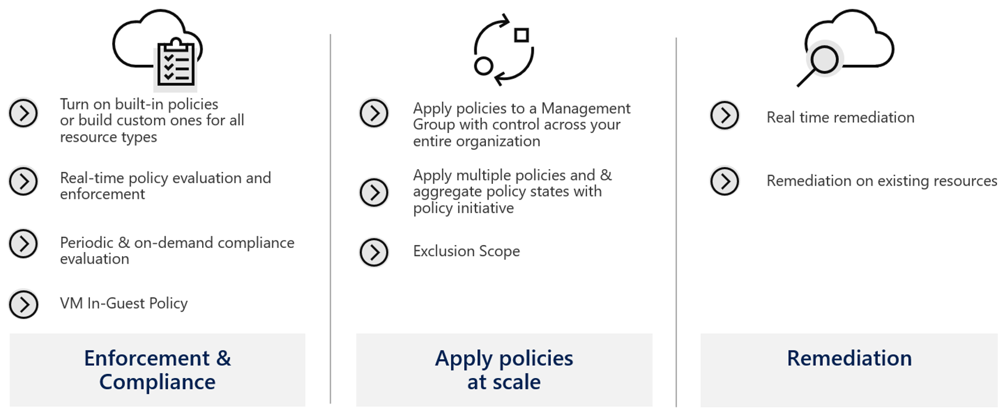

# Azure Policy

Policy is the backbone of Azure implementation and compliance. Compliance is an evolving scenario that you will always need to assess and adjust according to the needs of the moment. You also need to carefully plan your policies so as not to interrupt other units that require a more flexible policy than the one you have defined.&#x20;

Through policies, you can control the types of resources that can be provisioned. Or, you can restrict the locations where resources can be provisioned. Unlike RBAC, the policy is a standard system of explicit permission and denial.

Azure Policy is a service that you use to create, assign and manage policy definitions. Policy definitions impose different rules and actions on your resources, so that those resources remain in compliance with your corporate standards and service level agreements.

The policy focuses on the properties of resources during deployment and for existing resources. It performs an assessment of your resources, checking those that do not conform to the policy definitions you have. A very interesting new feature is the VM guest policy which extends the policy's capacity to the resources running within your VMs.

**Reference:**\


Overview of Azure Policy\


