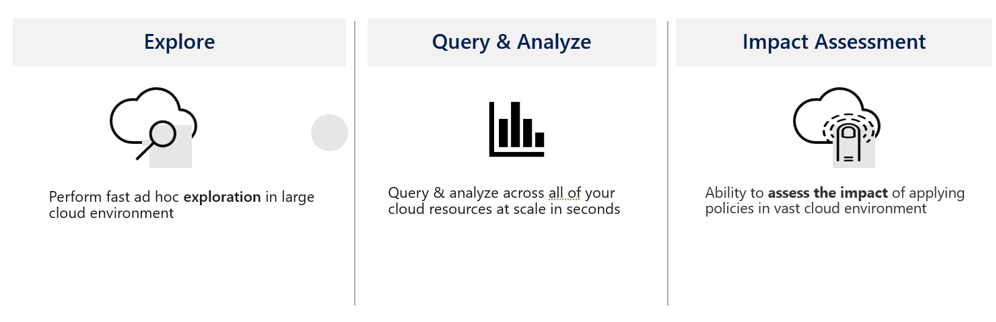

# Azure Resource Graph

There are a few challenges today when it comes to getting visibility of all your resources properties in all subscriptions and understanding how they can be impacting negatively your organization, being from a cost or a security perspective.

* Inability to view resources and their properties across subscriptions
* Query resources (without worrying about timeouts & throttling), including filtering, grouping, and, sorting of resources by resource properties
* The Resource Graph provides a way to interactively explore resources, so you can assess the impact of applying policies in a vast cloud environment

Resource Graph is the tool that comes to cover those needs allowing you to query and explore your resources in real-time.

**Reference:**&#x20;


