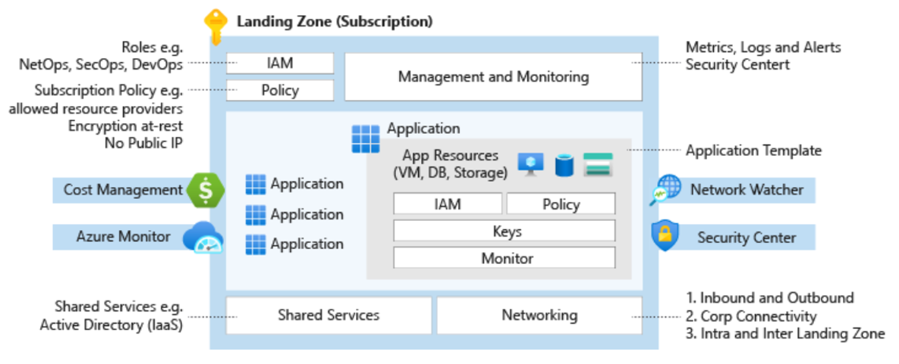
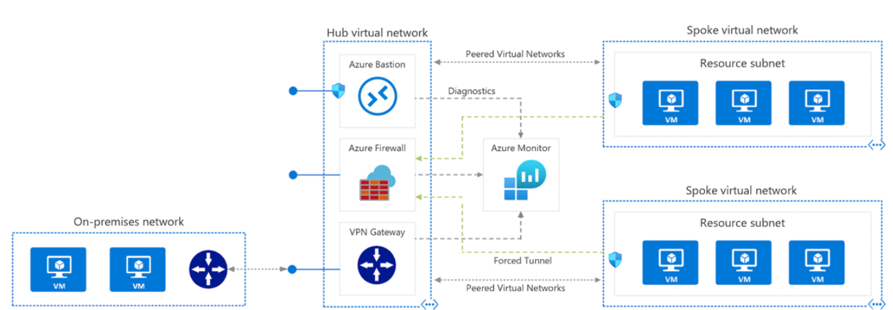
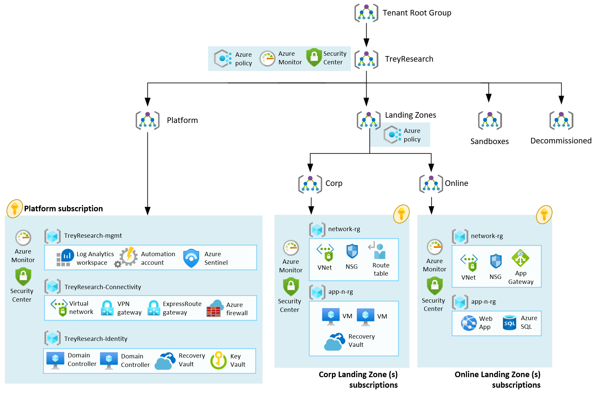

# Overview of Enterprise Scale Landing Zones

As described in [this link](https://docs.microsoft.com/en-us/azure/cloud-adoption-framework/ready/azure-best-practices/initial-subscriptions), the recommendation is that there are at least two signatures, one for the production environment and the other for the non-production environment. Depending on the size of your environment or the strategy of your company, it may be necessary to create more signatures and in addition to combine the design of signatures with the definition of the [landing zone](https://docs.microsoft.com/en-us/azure/cloud-adoption-framework/ready/landing-zone/) to be created.

The Microsoft [Cloud Adoption Framework](http://aka.ms/caf) describes in detail several topics over the [enterprise-scale landing zone architecture](https://docs.microsoft.com/en-us/azure/cloud-adoption-framework/ready/enterprise-scale/), which offers a modular design and not only makes it simple to deploy existing and new applications but also allows organizations to start with a lighter deployment implementation and scale depending on their business needs.

Basically, the landing zone will deal with a set of considerations and recommendations based on some design areas:

* [Enterprise Agreement (EA) enrolment and Azure Active Directory tenants](https://docs.microsoft.com/azure/cloud-adoption-framework/ready/enterprise-scale/enterprise-enrollment-and-azure-ad-tenants/)
* [Identity and access management](https://docs.microsoft.com/azure/cloud-adoption-framework/ready/enterprise-scale/identity-and-access-management/)
* [Management group and subscription organization](https://docs.microsoft.com/azure/cloud-adoption-framework/ready/enterprise-scale/management-group-and-subscription-organization/)
* [Network topology and connectivity](https://docs.microsoft.com/azure/cloud-adoption-framework/ready/enterprise-scale/network-topology-and-connectivity/)
* [Management and monitoring](https://docs.microsoft.com/azure/cloud-adoption-framework/ready/enterprise-scale/management-and-monitoring/)
* [Business continuity and disaster recovery](https://docs.microsoft.com/azure/cloud-adoption-framework/ready/enterprise-scale/business-continuity-and-disaster-recovery/)
* [Security, governance, and compliance](https://docs.microsoft.com/azure/cloud-adoption-framework/ready/enterprise-scale/security-governance-and-compliance)
* [Platform automation and DevOps](https://docs.microsoft.com/en-us/azure/cloud-adoption-framework/ready/enterprise-scale/platform-automation-and-devops)

The choice of network topology to be used is important for the process of governance definition. For example, the Hub and Spoke topology may be inserted in the context of subscriptions as follows:

* The first subscription for **shared services** (Hub Virtual Network)
* A second subscription for the **production** environment (Spoke Virtual Network - at the top right)
* A third subscription for the **non-production** environment (Spoke Virtual Network - at the bottom right)


Some references about Hub and Spoke topology:

* [https://docs.microsoft.com/en-us/azure/architecture/reference-architectures/hybrid-networking/hub-spoke](https://docs.microsoft.com/en-us/azure/architecture/reference-architectures/hybrid-networking/hub-spoke)
* [https://docs.microsoft.com/en-us/azure/cloud-adoption-framework/decision-guides/software-defined-network/hub-spoke](https://docs.microsoft.com/en-us/azure/cloud-adoption-framework/decision-guides/software-defined-network/hub-spoke)
* [Enterprise-scale foundation](https://github.com/Azure/Enterprise-Scale/blob/main/docs/reference/wingtip/README.md)


Approaching the Enterprise Scale Landing Zone, the architecture above could be translated into the architecture below to bring the "enterprise-scale" ability to the environment:&#x20;

As you can note, this architecture adopts the usage of different Management Groups and Subscriptions to split the environment into two main groups: **Platform** and **Landing Zones,** this principle suggests production environments transitioned to business units and workload units. This allows workload owners to have more control and autonomy of their workloads within the guardrails established by the platform foundation.

Currently, enterprise-scale offers [different reference implementations](https://docs.microsoft.com/en-us/azure/cloud-adoption-framework/ready/enterprise-scale/implementation), which all can be scaled without refactoring when requirements change over time.


**Pro tip!**

:white\_check\_mark:️ [Enterprise-Scale - Reference Implementation](https://github.com/Azure/Enterprise-Scale)

