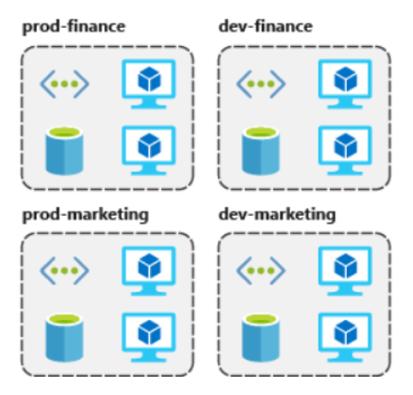

# Resource Groups

Resource groups are the approach that allows you to group a collection of objects into logical groups, facilitating provisioning, monitoring, access, and cost control. The benefit of using resource groups is precisely the grouping of resources that are part of the same application or share the same life cycle from creation to de-provisioning.

The underlying technology that empowers resource groups is [Azure Resource Manager (ARM)](https://docs.microsoft.com/en-us/azure/azure-resource-manager/management/overview). Just for information, ARM was created to replace the previous technology called Azure Service Manager (ASM) that powered the old Azure management portal. In ASM, users created resources in an unstructured way, leading to many challenges in tracking those resources or understanding their dependencies. You can see more details here:&#x20;


Resource Manager and classic deployment


Since ARM became available, these and other challenges have been addressed in addition to providing a new set of application programming interfaces (APIs) for provisioning resources in Azure. ARM requires resources to be placed in groups of resources, allowing the logical grouping of related resources.

**References:**


Principles of resource groups



Manage resource groups

