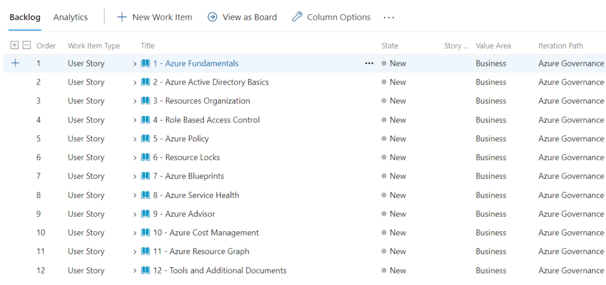
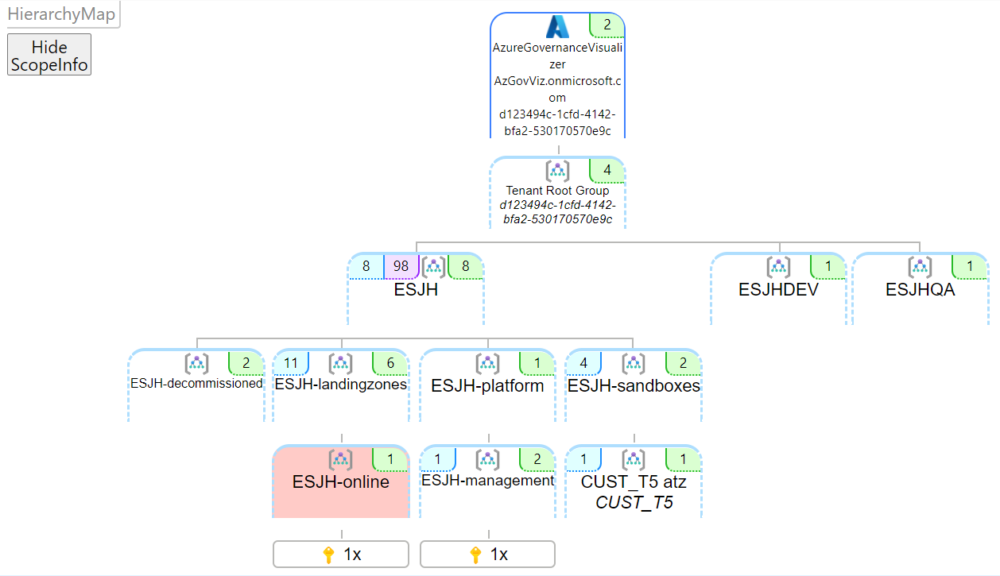

# Final considerations

## Azure DevOps Governance Generator

Now that you have the knowledge about the importance of adopting Governance and what tools Azure makes available for you to implement, how about starting to put it into practice?

Having a board containing all the information related to governance from the details of how it works to the details on how to implement it could be useful? Also, if you could share this board with your entire team to discuss each point, delegate activities, create iterations and track the progress of each task, would it be interesting?

So come on. Visit [https://aka.ms/azgovernancereadiness](https://aka.ms/azgovernancereadiness) and find out how to use Azure DevOps Generator to get it all for free and start implementing Azure Governance in your organization.

## Azure Governance Visualizer

What do you think about a have a graphical representation of your Governance implementation? Let me present you with one of my favorite tools: [AzGovViz](https://github.com/JulianHayward/Azure-MG-Sub-Governance-Reporting).

The AzGovViz (Azure governance visualizer) is a PowerShell script that iterates through an Azure tenant's management group hierarchy down to the subscription level. It captures data from the most relevant Azure governance capabilities such as Azure Policy, Azure role-based access control (Azure RBAC), and Azure Blueprints. From the collected data, the visualizer shows your hierarchy map, creates a tenant summary, and builds granular scope insights about your management groups and subscriptions.

## Azure Workbook for Landing Zone Review

We have a Landing Zone [Workbook](https://docs.microsoft.com/en-us/azure/azure-monitor/visualize/workbooks-overview) you can deploy to your environment to validate the usage of all Azure CAF best practices. Is [available here](https://github.com/Azure/fta-landingzone/tree/main/LZReview) and is highly recommended to use.

The aim of this workbook is to visualise core components of an Azure Landing Zone with the focus on the core components. This workbook currently visualises the following checks:
* Governance
    * Subscription health
    * Tag use
    * Policy Assignments
    * Resource Locks use
    * Azure Security Center/Defender status + Secure Score
    * Azure Monitor components + Log Analytics workspaces
* Identity and RBAC
    * Azure Advisor findings around Identity and Access
* Networking
    * Subnets without NSGs
    * Virtual Network Gateways
* Compute
    * Virtual Machines wih public IP addresses directly assigned
    * Virtual Machines with unmanaged disks
* Storage
    * Storage accounts with Secure Transfer Only disabled

## PSRule for Azure

PSRule for Azure is a pre-built set of tests and documentation to help you configure Azure solutions. These tests allow you to check your Infrastructure as Code (IaC) before or after deployment to Azure. PSRule for Azure includes tests that check how IaC is written and how Azure resources are configured. See more at [https://azure.github.io/PSRule.Rules.Azure/](https://azure.github.io/PSRule.Rules.Azure/)

## Feedback

Feel free to reach out to me and share any feedback you may have!&#x20;

* [LinkedIn](https://www.linkedin.com/in/ricmmartins)
* [GitHub](https://github.com/ricmmartins/)

👋 **Ricardo Martins**

